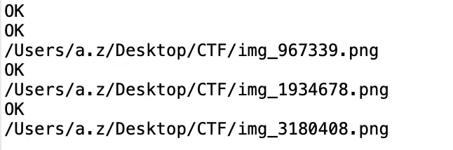

# angstromCTF 2022-04-30

## MISC

### PNG Image steganography


The header of PNG file is **89 50 4E 47 0D 0A 1A 0A**

and we could see the text: **‰PNG**

The ending is **60 82**

By looking at the hexadecimal we can see that the 4.1M image file has 4 headers and endings (PNG images) inside.

Using the following codes, the files inside it could be separated and the flag will be found.

```java
import java.io.*;
public class amongus {
    protected static byte[] strbyte = null;
    public static StringBuffer sb = new StringBuffer();
    public static void main(String[] args) throws Exception {
        FileInputStream in = new FileInputStream("/Users/a.z/Desktop/CTF/confetti.png");
        DataInputStream din = new DataInputStream(in);

        int length = din.available();
        byte[] data = new byte[length];
        // Read the file
        din.read(data);
        int startPos = 0;
        int endPos = 0;

        for (int j = 0; j < data.length; j++) {
            String tmp = Integer.toHexString(0xFF & data[j]).toUpperCase();
            if (tmp.length() < 2) {
                for (int i = tmp.length(); i < 2; i++)
                    tmp = "0" + tmp;
            }
            sb.append(tmp);

            //Convert to hex and determine if it is a PNG header
            if (sb.toString().endsWith("89504E470D0A1A0A0000000D49484452")) {
                System.out.println("OK");
                sb.delete(0,sb.length());
                if (j - 15 > 0) {
                    endPos = j - 15;
                    // Generate the PNG file
                    fileCreate(startPos,endPos,data);
                    startPos = j - 15;
                }
            }
        }
        din.close();
    }

    public static void fileCreate(int startPos, int endPos, byte[] data) throws IOException {
        String pngFilePathName = "/Users/a.z/Desktop/CTF/img_"+endPos+".png";
        FileOutputStream out = new FileOutputStream(pngFilePathName);
        BufferedOutputStream buffout = new BufferedOutputStream(out);
        DataOutputStream dataout = new DataOutputStream(buffout);
        for (int j = startPos; j < endPos; j++) {
            dataout.write(data[j]);
        }
        dataout.close();
        System.out.println(pngFilePathName);
    }
}

```

The output is as follow


The flag is shown on the third figure.


<span style="color: gray;">(P.S. tho this program is not very efficient and runs a bit slow</span>


